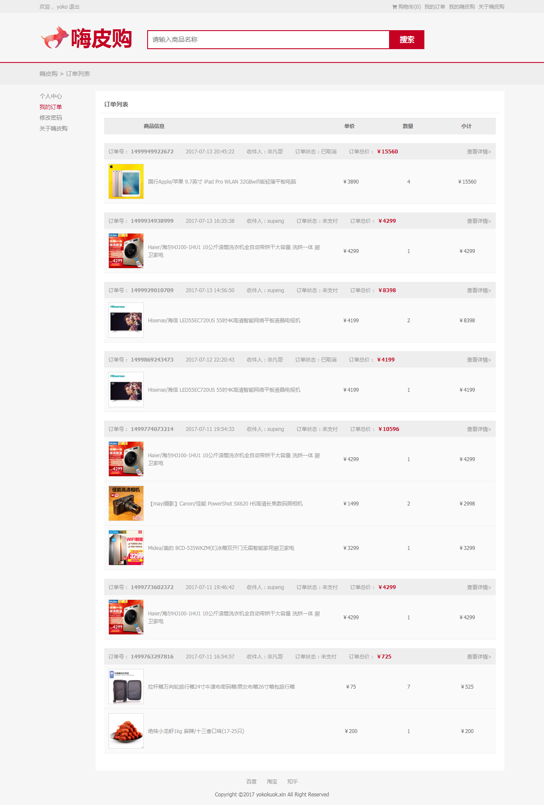
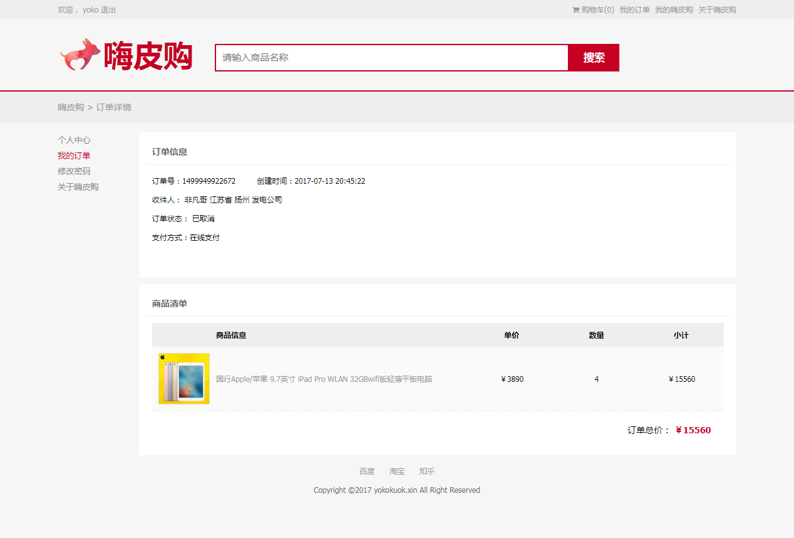

# 安装指南

### 下载安装 Git node npm

1. Git安装网址      ：  https://git-scm.com/downloads
2. Node.js 安装网址 ：  https://nodejs.org/zh-cn/download/ （新版Node.js包含npm）

### Terminal 检查版本
```
node -v  
```
```
npm -v
```

### Terminal 安装项目

1. ```npm install```
2. ```webpack ```
3. ```npm run dev_win```  windows系统   
   ```npm run dev```    非windows系统
4. http://localhost:8088/dist/view/index.html  浏览器打开该网址

### 本购物商城域名（备案中）

yokokuok.xin

### 暂用代理

#### Charles

1. 在http://localhost:8088 右键 Map remote 
2.  

Map From:
```
Prorocol: http
Host:localhost 
Port:8088
Path:/user/*
```

Map To:

```
Prorocol: http
Host:www.happymmall.com
Port:80
Path:/user/
```

- 其他以此类推 manage/product
```
/manage/*
```

```
/manage/
```


## 网站快照

声明：本网站均采用网络图片作为网站演示，如有侵权行为，请联系本人。

- 首页


- 产品列表


- 产品详情


- 我的订单



- 订单信息

